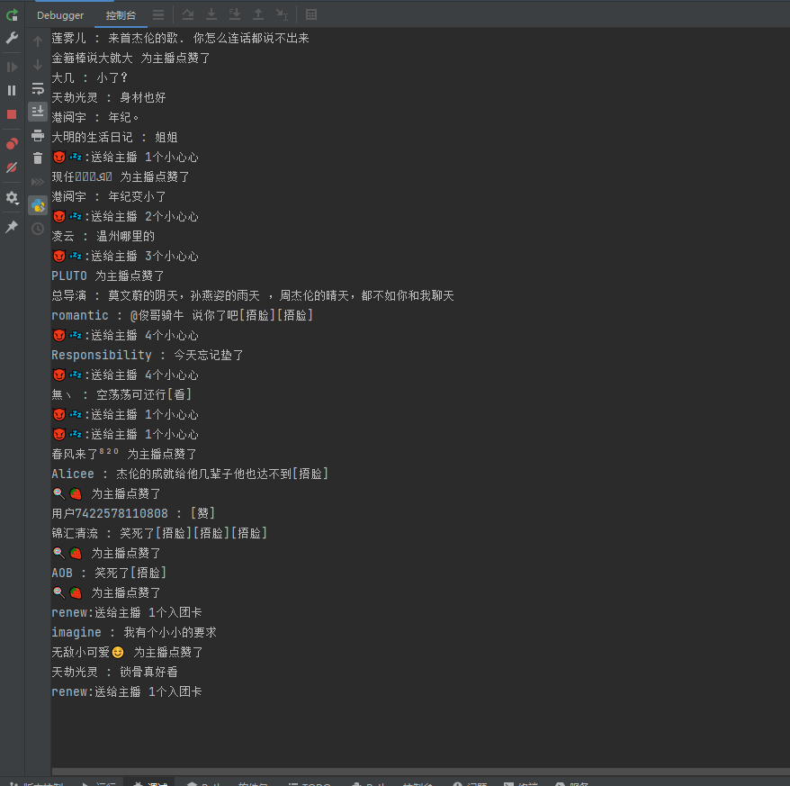

# douyin
####  抖音直播 抖音弹幕 直播弹幕 匿名弹幕 隐私直播间



### 返回code常用状态码说明
|状态码|说明|
|--|--|
|0|仅表示请求成功|
|401004|用户不存在,请先开户|
|401005|用户被锁定|
|401017|次数用完|
|401018|token缺失|
|500001|系统内部异常|
|500002|请求有问题|

|已完成|等待添加|
|--|--|
|主页信息|粉丝列表|
|视频详情|用户搜索(已添加)|
|评论列表|视频搜索(已添加)|
|回复列表|话题搜索|
|作品列表|用户橱窗|
|点赞列表|商品详情|
|主页手机||
|实时弹幕 ||
|水印解析 ||
|隐私直播间弹幕 ||
|匿名直播间弹幕 ||


## 1.抖音主页完整信息
```
/dy/user/info/all
```
### 参数:
|参数名|类型|必选|说明|
|--|:--:|:--:|:--|
|token|string|是|访问凭证|
|uid|string|是|用户uid|
|secId|string|否|MS4开头的id,和 uid二选一|


## 2.抖音主页基本信息
```
/dy/user/info/base
```
### 参数:
|参数名|类型|必选|说明|
|--|:--:|:--:|:--|
|token|string|是|访问凭证|
|dyId|string|是|抖音号,和secId二选一|
|secId|string|否|MS4开头的id,和 dyId二选一|

## 3.抖音视频详情
```
/dy/v/detail
```
### 参数:
|参数名|类型|必选|说明|
|--|:--:|:--:|:--|
|token|string|是|访问凭证|
|vid|string|是|视频id|


## 4.抖音评论列表
```
/dy/v/comments
```
### 参数:
|参数名|类型|必选|说明|
|--|:--:|:--:|:--|
|token|string|是|访问凭证|
|vid|string|是|视频id|
|pageIndex|string|是|翻页参数，首次为0，根据下一次的返回cursor的值进行下一页|


## 5.评论回复列表
```
/dy/v/comments4replays
```
### 参数:
|参数名|类型|必选|说明|
|--|:--:|:--:|:--|
|token|string|是|访问凭证|
|vid|string|是|视频id|
|cid|string|是|组id，根据视频评论接口获取|
|pageIndex|string|是|翻页参数，首次为0，根据下一次请求结果cursor值进行下一页|


## 6.抖音用户视频作品列表
```
/dy/user/videos
```
### 参数:
|参数名|类型|必选|说明|
|--|:--:|:--:|:--|
|token|string|是|访问凭证|
|secId|string|是|开头MS4的id|
|pageIndex|string|是|翻页参数，首次为0，根据下一次请求结果max_cursor值进行翻页|

## 7.抖音用户喜欢点赞列表
```
/dy/user/likes
```
### 参数:
|参数名|类型|必选|说明|
|--|:--:|:--:|:--|
|token|string|是|访问凭证|
|maxCursor|string|是|翻页参数，首次为0，根据下一次请求结果max_cursor值进行翻页|
|secId|string|否|MS4开头的id|

## 8.抖音主页手机
```
/dy/user/phone
```
### 参数:
|参数名|类型|必选|说明|
|--|:--:|:--:|:--|
|token|string|是|访问凭证|
|encryStr|string|是|主页信息encrypt_mobile参数|

<details> 
 <summary><font size="4" color="orange">查看返回数据</font></summary> 
 <pre>
  <code class="language-cpp">
    {
      "code": "0",
      "mobile": "12345678910"
    }

  </code>
 </pre>
</details>

## 9.抖音用户搜索
```
/dy/search/user
```
### 参数:
|参数名|类型|必选|说明|
|--|:--:|:--:|:--|
|token|string|是|访问凭证|
|username|string|是|关键词|
|pageIndex|int|是|翻页参数，默认=1|


## 10.抖音视频搜索
```
/dy/search/v
```
### 参数:
|参数名|类型|必选|说明|
|--|:--:|:--:|:--|
|token|string|是|访问凭证|
|vname|string|是|关键词|
|soutType|int|是|0=综合排序：1=最多点赞，2=最新发布|
|timeRange|int|是|发布时间：0=不限，1=一天内， 7=一周内，182=半年内|
|pageIndex|int|是|翻页参数，默认为1|


## 其他
### 调用次数/剩余次数查询
```
/user/reqCount
```
|参数名|类型|必选|说明|
|--|:--:|:--:|:--|
|token|string|是|访问凭证|


```
有任何问题可交流学习  
请勿使用本服务于商用   
请勿使用本服务大量抓取   
若因使用本服务与平台造成不必要的纠纷，本人盖不负责  
本人纯粹技术爱好，若侵犯贵公司的权益，请告知  
```

### 联系QQ:45497494
###


### [小红书](https://github.com/canglingzhiyue/xiaohongshu)
### [知乎](https://github.com/canglingzhiyue/zhihu)
